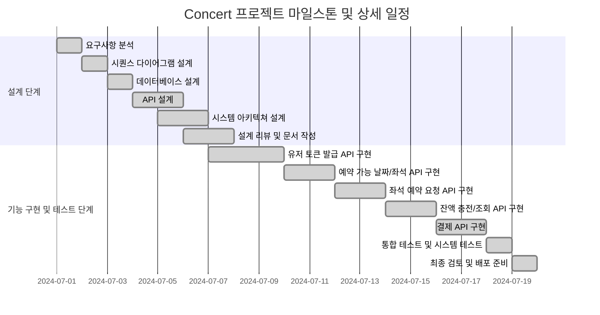
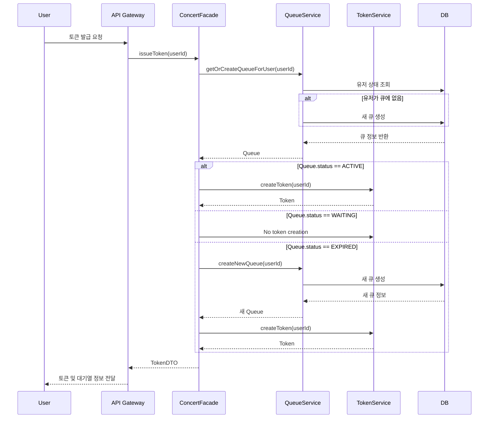
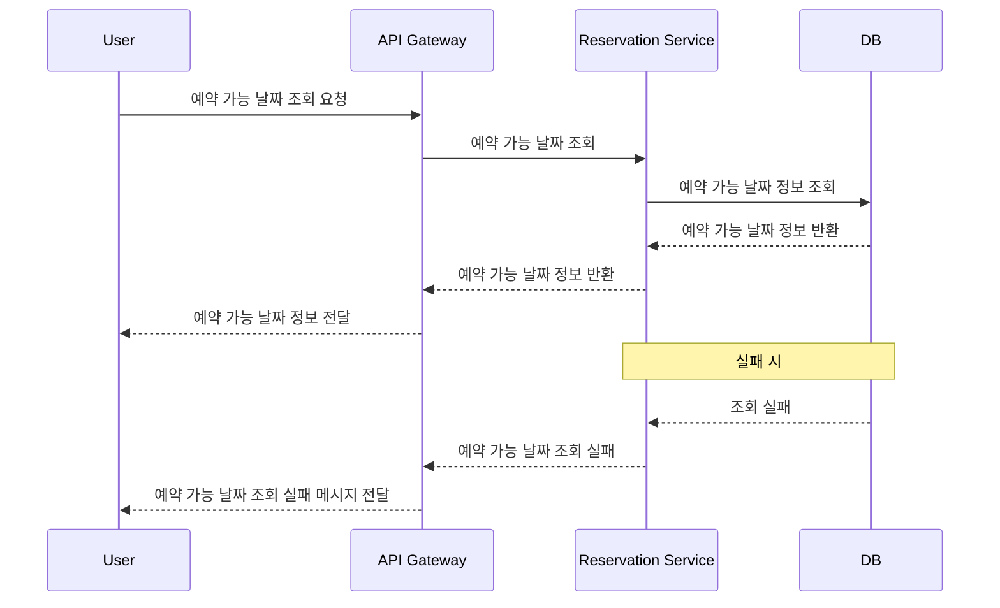
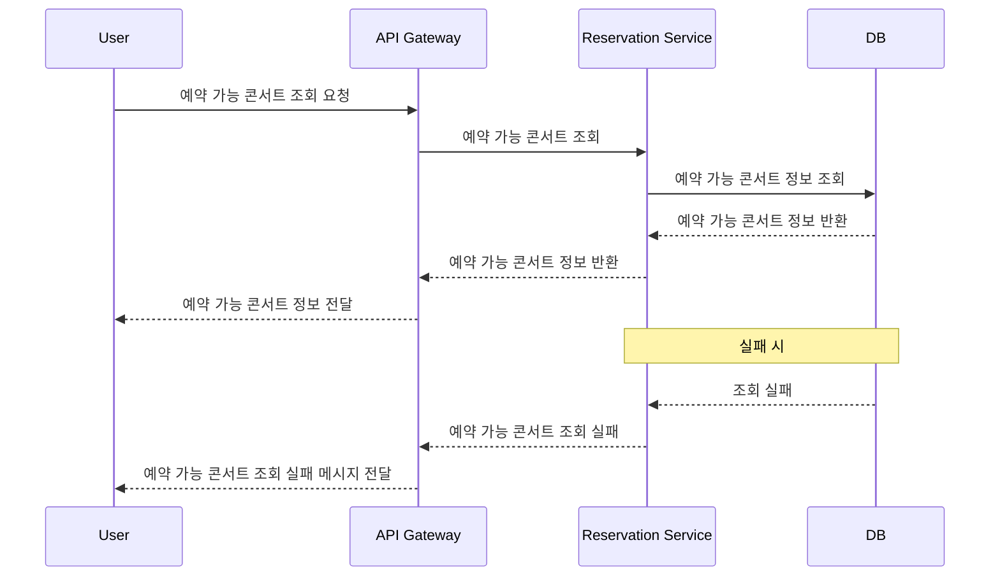
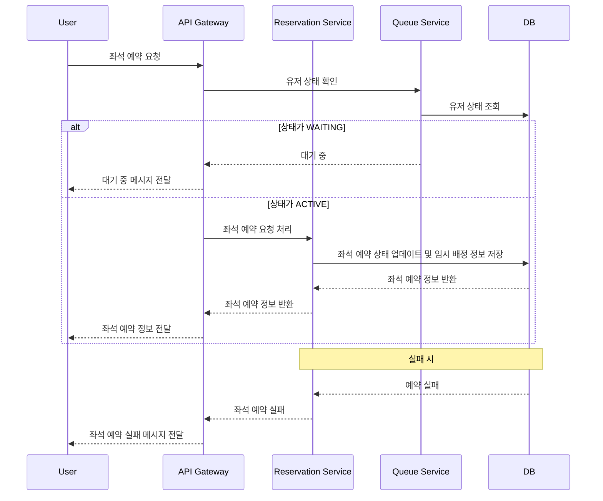
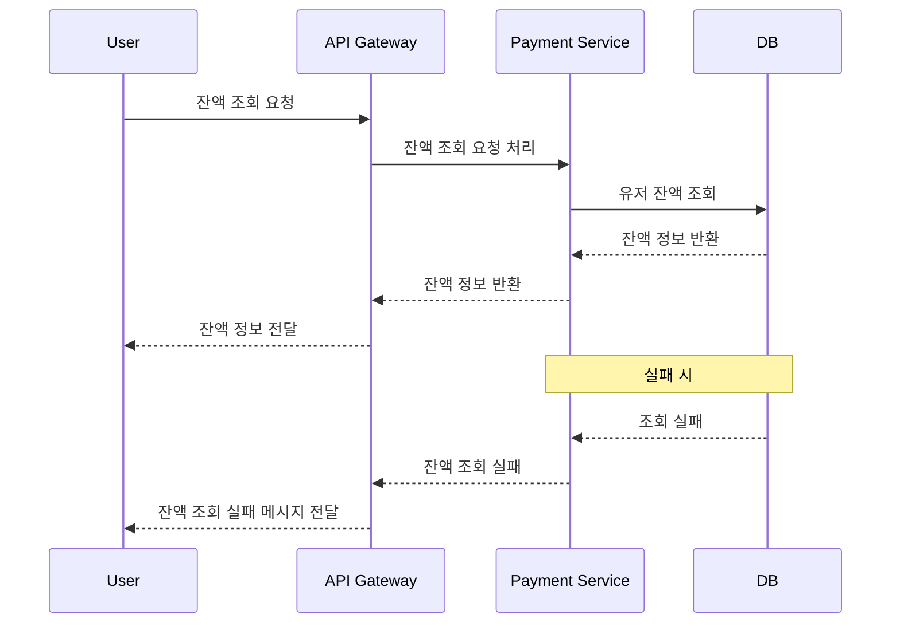
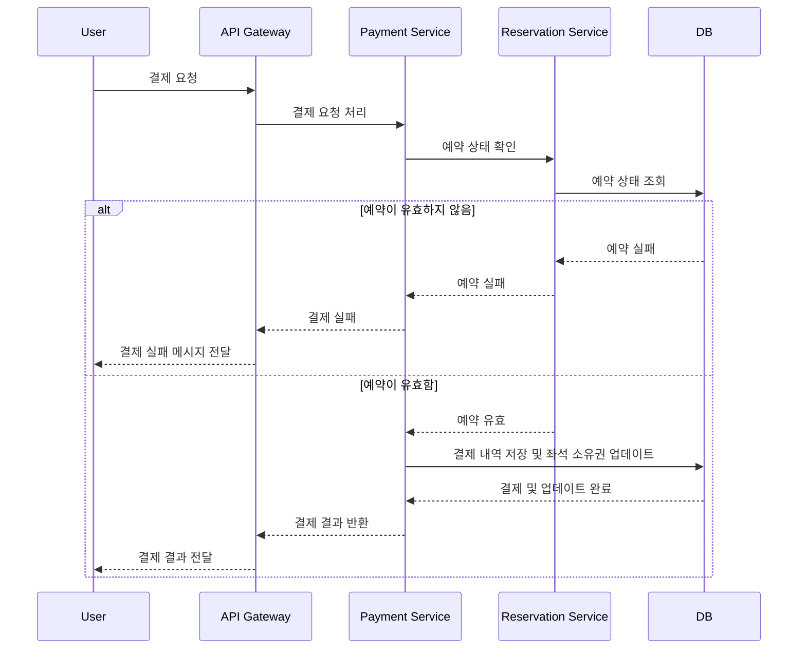
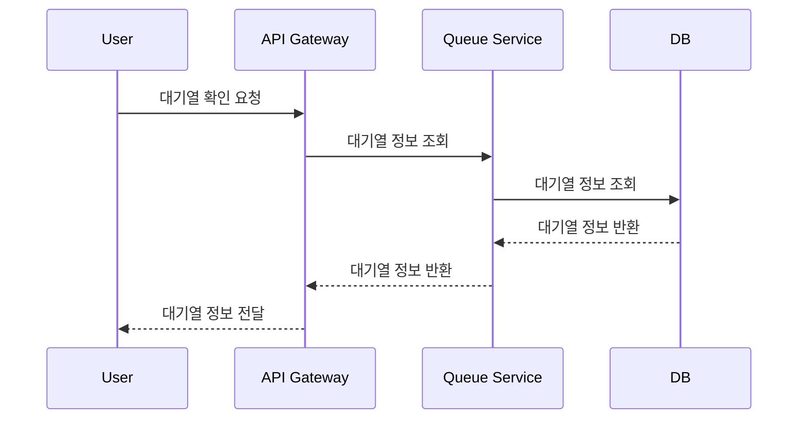
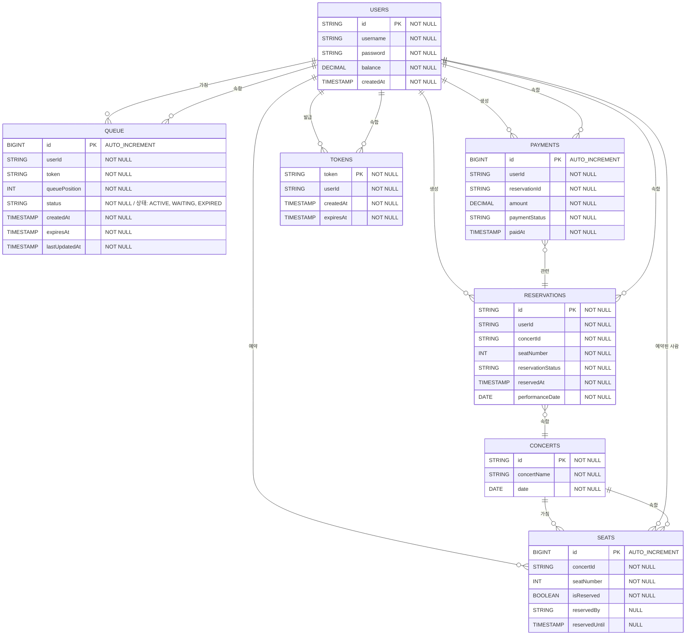
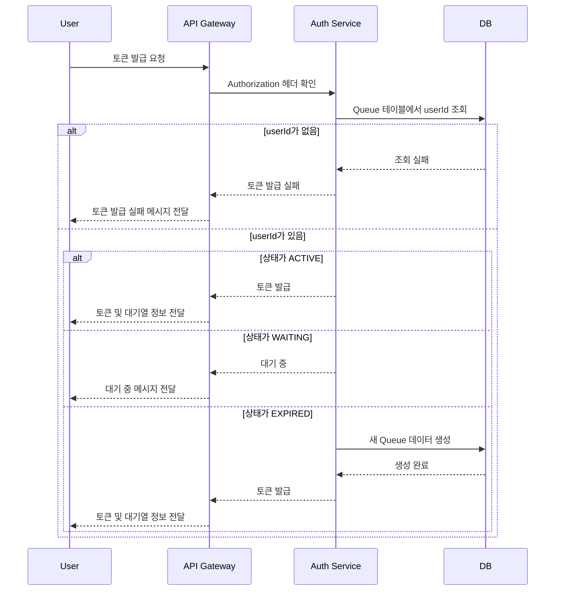

# 콘서트 예매 서버

## 프로젝트 개요

`콘서트 예약 서비스`는 사용자들이 콘서트 좌석을 예약하고, 예약을 위한 잔액을 충전하며, 결제를 완료할 수 있는 시스템입니다. 이 서비스는 다수의 사용자가 동시에 접근할 수 있는 대기열 시스템을 포함하며, 동시성 이슈를 고려하여 설계됩니다.

## 주요 기능 및 제약사항

1. **유저 토큰 발급 API**: 사용자가 대기열에 들어가서 서비스를 이용할 수 있도록 토큰을 발급합니다.
2. **예약 가능 날짜 / 좌석 API**: 예약 가능한 날짜와 해당 날짜의 좌석 정보를 조회합니다.
3. **좌석 예약 요청 API**: 사용자가 좌석을 임시로 예약하고 결제가 이루어지지 않으면 임시 배정을 해제합니다.
4. **잔액 충전 / 조회 API**: 사용자가 예약에 사용할 금액을 충전하고, 현재 잔액을 조회합니다.
5. **결제 API**: 사용자가 좌석 예약 후 결제를 완료하면 좌석을 최종 배정합니다.
6. **대기열 확인 API**: 사용자가 현재 대기열에서 자신의 위치를 확인할 수 있습니다.
7. **대기열 추가 API:** 사용자가 현재 대기열에 자신을 추가할 수 있습니다.

## 1. 목표 설정

- 유저가 대기열을 통해 콘서트 좌석을 예약하고 결제까지 완료할 수 있는 시스템 구축.
- 동시성 이슈를 고려하여 다수의 사용자가 동시에 접근할 때도 안정적으로 서비스 제공.

## 2. 기술 스택

- **언어**: Java
- **프레임워크**: Spring Boot
- **데이터베이스**: MySQL (대기열 관리 및 데이터 저장)
- **테스트 프레임워크**: JUnit, Mockito
- **인증**: JWT

## 3. 아키텍처 설계

- **모듈 구성**:
    - **User Module**: 사용자 관리 및 인증
    - **Queue Module**: 대기열 관리
    - **Reservation Module**: 예약 처리
    - **Payment Module**: 결제 처리
- **데이터베이스 설계**:
    - **Users**: 유저 정보
    - **Seats**: 좌석 정보
    - **Reservations**: 예약 정보
    - **Payments**: 결제 내역
    - **Queue**: 대기열 정보

## 4. API Spec

### 4.1 유저 토큰 발급 API

- **Endpoint**: `/api/v1/tokens`
- **Method**: POST
- **Request**:
    
    ```json
    {
      "userId": "UUID"
    }
    ```
    
- **Response**:
    
    ```json
    {
      "token": "string",
      "queuePosition": "int",
      "remainingTime": "int"
    }
    ```
    
- **Error Codes** :
    - `400 Bad Request`: Invalid request payload.
    - `404 Not Found`: User not found.
    - `409 Conflict`: User already in the queue.
    - `500 Internal Server Error`: Server encountered an unexpected condition.

### 4.2 예약 가능 날짜 / 좌석 API

- **Endpoint**: `/api/v1/reservations/dates`
- **Method**: GET
- **Response**:
    
    ```json
    [
      {
        "concertId": "UUID",
        "concertName": "Concert Name",
        "date": "2024-07-03"
      },
      {
        "concertId": "UUID",
        "concertName": "Concert Name",
        "date": "2024-07-04"
      },
      ...
    ]
    ```
    
- **Error Codes**:
    - `500 Internal Server Error`: Server encountered an unexpected condition.
- **Endpoint**: `/api/v1/reservations/{concertId}/seats`
- **Method**: GET
- **Response**:
    
    ```json
    [
      {
        "seatNumber": 1,
        "available": true
      },
      {
        "seatNumber": 2,
        "available": false
      },
      ...
    ]
    ```
    
- **Error Codes**:
    - `400 Bad Request`: Invalid concert ID.
    - `404 Not Found`: Concert not found.
    - `500 Internal Server Error`: Server encountered an unexpected condition.

### 4.3 좌석 예약 요청 API

- **Endpoint**: `/api/v1/reservations`
- **Method**: POST
- **Request**:
    
    ```json
    {
      "concertId": "UUID",
      "seatNumber": 1,
      "token": "string"
    }
    ```
    
- **Response**:
    
    ```json
    {
      "reservationId": "UUID",
      "expiresAt": "timestamp"
    }
    ```
    
- **Error Codes**:
    - `400 Bad Request`: Invalid request payload.
    - `401 Unauthorized`: User not authenticated.
    - `403 Forbidden`: User not allowed to make a reservation.
    - `404 Not Found`: Concert or seat not found.
    - `409 Conflict`: Seat already reserved.
    - `500 Internal Server Error`: Server encountered an unexpected condition.

### 4.4 잔액 충전 / 조회 API

- **Endpoint**: `/api/v1/payments/recharge`
- **Method**: POST
- **Request**:
    
    ```json
    {
      "userId": "string",
      "amount": "BigDecimal"
    }
    ```
    
- **Response**:
    
    ```json
    {
      "newBalance": "int",
      "currentBalance": "int"
    }
    ```
    
- **Error Codes**:
    - `400 Bad Request`: Invalid request payload.
    - `404 Not Found`: User not found.
    - `500 Internal Server Error`: Server encountered an unexpected condition.
- **Endpoint**: `/api/v1/payments/balance/{userId}`
- **Method**: GET
- **Response**:
    
    ```json
    {
      "newBalance": "int",
      "currentBalance": "int"
    }
    ```
    
- **Error Codes**:
    - `404 Not Found`: User not found.
    - `500 Internal Server Error`: Server encountered an unexpected condition.

### 4.5 결제 API

- **Endpoint**: `/api/v1/payments/process`
- **Method**: POST
- **Request**:
    
    ```json
    {
      "reservationId": "UUID",
      "amount": 100,
      "token": "string"
    }
    ```
    
- **Response**:
    
    ```json
    {
      "paymentId": "UUID",
      "status": "success"
    }
    ```
    
- **Error Codes**:
    - `400 Bad Request`: Invalid request payload.
    - `401 Unauthorized`: User not authenticated.
    - `403 Forbidden`: User not allowed to make a payment.
    - `404 Not Found`: Reservation not found.
    - `409 Conflict`: Payment already processed or insufficient balance.
    - `500 Internal Server Error`: Server encountered an unexpected condition.

### 4.6 대기열 확인 API

- **Endpoint**: `/api/v1/queue/status`
- **Method**: GET
- **Request**:
    
    ```json
    {
      "token": "string"
    }
    ```
    
- **Response**:
    
    ```json
    {
      "queuePosition": "int",
      "remainingTime": "int"
    }
    ```
    
- **Error Codes**:
    - `400 Bad Request`: Invalid request payload.
    - `401 Unauthorized`: User not authenticated.
    - `404 Not Found`: Token not found.
    - `410 Gone`: Token expired.
    - `500 Internal Server Error`: Server encountered an unexpected condition.

### 4.7 대기열 추가 API

- **Endpoint**: `/api/v1/queue/in`
- **Method**: GET
- **Request**:
    
    ```json
    {
      "token": "string"
    }
    ```
    
- **Response**:
    
    ```json
    {
      "queuePosition": "int",
      "status": "string",
      "remainingTime": "long"
    }
    ```
    
- **Error Codes**:
    - `400 Bad Request`: Invalid request payload.
    - `401 Unauthorized`: User not authenticated.
    - `404 Not Found`: Token not found.
    - `410 Gone`: Token expired.
    - `500 Internal Server Error`: Server encountered an unexpected condition.

## 5. Gantt



## 6. 상세 일정

### 프로젝트 마일스톤 및 상세 일정 (수정)

### 프로젝트 기간

2024년 7월 1일 ~ 2024년 7월 19일

### 마일스톤

1. **설계 단계** (7월 1일 ~ 7월 6일)
2. **기능 구현 및 테스트** (7월 7일 ~ 7월 19일)

### 설계 단계 (7월 1일 ~ 7월 6일)

- **7월 1일**
    - 프로젝트 요구사항 분석
    - 주요 기능 정의
    - 기술 스택 확정
- **7월 2일**
    - 시퀀스 다이어그램 설계
- **7월 3일**
    - 데이터베이스 설계
    - 테이블 구조 정의 (Users, Seats, Reservations, Payments, Queue)
- **7월 4일**
    - API 설계 (유저 토큰 발급, 예약 가능 날짜/좌석, 좌석 예약 요청, 잔액 충전/조회, 결제)
    - 엔드포인트 정의 및 Request/Response 설계
- **7월 5일**
    - 시스템 아키텍처 설계
    - 모듈화 구조 정의 (User Module, Queue Module, Reservation Module, Payment Module)
- **7월 6일**
    - 전체 설계 리뷰 및 피드백 반영
    - 최종 설계 문서 작성

### 기능 구현 및 테스트 단계 (7월 7일 ~ 7월 19일)

- **7월 7일 ~ 7월 9일**
    - 유저 토큰 발급 API 구현
    - 단위 테스트 작성 및 테스트
- **7월 10일 ~ 7월 11일**
    - 예약 가능 날짜/좌석 API 구현
    - 단위 테스트 작성 및 테스트
- **7월 12일 ~ 7월 13일**
    - 좌석 예약 요청 API 구현
    - 단위 테스트 작성 및 테스트
- **7월 14일 ~ 7월 15일**
    - 잔액 충전/조회 API 구현
    - 단위 테스트 작성 및 테스트
- **7월 16일 ~ 7월 17일**
    - 결제 API 구현
    - 단위 테스트 작성 및 테스트
- **7월 18일**
    - 통합 테스트 및 전체 시스템 테스트
    - 버그 수정 및 최종 조정
- **7월 19일**
    - 최종 검토 및 배포 준비
    - 프로젝트 문서화 및 마무리

## 7. SequenceDiagram

### 유저 토큰 발급 Use Case



### 예약 가능 날짜 조회 Use Case



### 예약 가능 콘서트 조회 Use Case



### 좌석 예약 요청 Use Case



### 잔액 충전 요청 Use Case



### 결제 요청 Use Case



### 대기열 확인 요청 Use Case



- https://sequencediagram.org/
    
    
    

## 8. DDL

**USERS 테이블**:

```sql
CREATE TABLE USERS (
    id VARCHAR(255) NOT NULL PRIMARY KEY,
    username VARCHAR(255) NOT NULL,
    password VARCHAR(255) NOT NULL,
    balance DECIMAL(10, 2) NOT NULL,
    createdAt TIMESTAMP NOT NULL DEFAULT CURRENT_TIMESTAMP
);
```

**CONCERT 테이블**:

```sql
CREATE TABLE CONCERTS (
    id VARCHAR(255) NOT NULL PRIMARY KEY,
    concertName VARCHAR(255) NOT NULL,
    date DATE NOT NULL
);
```

**Queue 테이블**:

```sql
CREATE TABLE QUEUE (
    id BIGINT AUTO_INCREMENT PRIMARY KEY,
    userId VARCHAR(255) NOT NULL,
    token VARCHAR(255) NOT NULL,
    queuePosition INT NOT NULL,
    status VARCHAR(50) NOT NULL,
    createdAt TIMESTAMP NOT NULL DEFAULT CURRENT_TIMESTAMP,
    expiresAt TIMESTAMP NOT NULL,
    lastUpdatedAt TIMESTAMP NOT NULL
);
```

**Seats 테이블**:

```sql
CREATE TABLE SEATS (
    id BIGINT AUTO_INCREMENT PRIMARY KEY,
    concertId VARCHAR(255) NOT NULL,
    seatNumber INT NOT NULL,
    isReserved BOOLEAN NOT NULL,
    reservedBy VARCHAR(255),
    reservedUntil TIMESTAMP,
    UNIQUE (concertId, seatNumber)
);
```

**Reservations 테이블**:

```sql
CREATE TABLE RESERVATIONS (
    id VARCHAR(255) NOT NULL PRIMARY KEY,
    userId VARCHAR(255) NOT NULL,
    concertId VARCHAR(255) NOT NULL,
    seatNumber INT NOT NULL,
    reservationStatus VARCHAR(50) NOT NULL,
    reservedAt TIMESTAMP NOT NULL DEFAULT CURRENT_TIMESTAMP,
    performanceDate DATE NOT NULL
);
```

**Payments 테이블**:

```sql
CREATE TABLE PAYMENTS (
    id BIGINT AUTO_INCREMENT PRIMARY KEY,
    userId VARCHAR(255) NOT NULL,
    reservationId VARCHAR(255) NOT NULL,
    amount DECIMAL(10, 2) NOT NULL,
    paymentStatus VARCHAR(50) NOT NULL,
    paidAt TIMESTAMP NOT NULL DEFAULT CURRENT_TIMESTAMP
);
```

**Tokens 테이블**:

```sql
CREATE TABLE TOKENS (
    token VARCHAR(255) NOT NULL PRIMARY KEY,
    userId VARCHAR(255) NOT NULL,
    createdAt TIMESTAMP NOT NULL DEFAULT CURRENT_TIMESTAMP,
    expiresAt TIMESTAMP NOT NULL
);
```

## 9. ERD



## 10. Project 구조

```markdown
├─main
│  ├─java
│  │  └─io
│  │      └─hhplus
│  │          └─concert
│  │              └─reservation
│  │                  │  Application.java
│  │                  │
│  │                  ├─application
│  │                  │  ├─dto
│  │                  │  │      ConcertDTO.java
│  │                  │  │      PaymentDTO.java
│  │                  │  │      QueueDTO.java
│  │                  │  │      ReservationDTO.java
│  │                  │  │      SeatDTO.java
│  │                  │  │      TokenDTO.java
│  │                  │  │      UserDTO.java
│  │                  │  │
│  │                  │  ├─exception
│  │                  │  │      ConcertNotFoundException.java
│  │                  │  │      GlobalExceptionHandler.java
│  │                  │  │      InsufficientBalanceException.java
│  │                  │  │      QueueExpiredException.java
│  │                  │  │      ReservationNotFoundException.java
│  │                  │  │      SeatAlreadyReservedException.java
│  │                  │  │      SeatNotFoundException.java
│  │                  │  │      TokenExpiredException.java
│  │                  │  │      TokenNotFoundException.java
│  │                  │  │      UserAlreadyInQueueException.java
│  │                  │  │      UserNotFoundException.java
│  │                  │  │      UserNotInQueueException.java
│  │                  │  │
│  │                  │  └─facade
│  │                  │          ConcertFacade.java
│  │                  │          ConcertFacadeImpl.java
│  │                  │
│  │                  ├─config
│  │                  │      SecurityConfig.java
│  │                  │      SwaggerConfig.java
│  │                  │      WebMvcConfig.java
│  │                  │
│  │                  ├─domain
│  │                  │  ├─model
│  │                  │  │      Concert.java
│  │                  │  │      Payment.java
│  │                  │  │      Queue.java
│  │                  │  │      Reservation.java
│  │                  │  │      Seat.java
│  │                  │  │      Token.java
│  │                  │  │      User.java
│  │                  │  │
│  │                  │  └─service
│  │                  │          ConcertService.java
│  │                  │          ConcertServiceImpl.java
│  │                  │          PaymentService.java
│  │                  │          PaymentServiceImpl.java
│  │                  │          QueueService.java
│  │                  │          QueueServiceImpl.java
│  │                  │          ReservationService.java
│  │                  │          ReservationServiceImpl.java
│  │                  │          TokenService.java
│  │                  │          TokenServiceImpl.java
│  │                  │          UserService.java
│  │                  │          UserServiceImpl.java
│  │                  │
│  │                  ├─infrastructure
│  │                  │  ├─entity
│  │                  │  │      ConcertEntity.java
│  │                  │  │      PaymentEntity.java
│  │                  │  │      QueueEntity.java
│  │                  │  │      ReservationEntity.java
│  │                  │  │      SeatEntity.java
│  │                  │  │      TokenEntity.java
│  │                  │  │      UserEntity.java
│  │                  │  │
│  │                  │  ├─mapper
│  │                  │  │      ConcertMapper.java
│  │                  │  │      PaymentMapper.java
│  │                  │  │      QueueMapper.java
│  │                  │  │      ReservationMapper.java
│  │                  │  │      ResponseMapper.java
│  │                  │  │      SeatMapper.java
│  │                  │  │      TokenMapper.java
│  │                  │  │
│  │                  │  └─repository
│  │                  │          ConcertRepository.java
│  │                  │          PaymentRepository.java
│  │                  │          QueueRepository.java
│  │                  │          ReservationRepository.java
│  │                  │          SeatRepository.java
│  │                  │          TokenRepository.java
│  │                  │          UserRepository.java
│  │                  │
│  │                  └─presentation
│  │                      ├─controller
│  │                      │      PaymentController.java
│  │                      │      QueueController.java
│  │                      │      ReservationController.java
│  │                      │      UserController.java
│  │                      │
│  │                      ├─filter
│  │                      │      CommonFilter.java
│  │                      │
│  │                      ├─interceptor
│  │                      │      ApiInterceptor.java
│  │                      │
│  │                      ├─request
│  │                      │      BalanceRequest.java
│  │                      │      PaymentRequest.java
│  │                      │      QueueRequest.java
│  │                      │      QueueStatusRequest.java
│  │                      │      ReservationRequest.java
│  │                      │      SeatReservationRequest.java
│  │                      │      UserRequest.java
│  │                      │      UserTokenRequest.java
│  │                      │
│  │                      └─response
│  │                              BalanceResponse.java
│  │                              ConcertDateResponse.java
│  │                              PaymentResponse.java
│  │                              QueueResponse.java
│  │                              QueueStatusResponse.java
│  │                              ReservationResponse.java
│  │                              SeatResponse.java
│  │                              TokenResponse.java
│  │                              UserResponse.java
│  │
│  └─resources
│          application.properties
│          schema.sql
│
└─test
    └─java
        └─io
            └─hhplus
                └─concert
                    └─reservation
                        │  ApplicationTests.java
                        │
                        ├─application
                        │  └─facade
                        │          ConcertFacadeTest.java
                        │
                        ├─config
                        │      TestSecurityConfig.java
                        │
                        ├─controller
                        │      ConcertControllerTest.java
                        │
                        └─presentation
                                PaymentControllerTest.java
                                QueueControllerTest.java
                                ReservationControllerTest.java
                                UserControllerTest.java
```

### (별첨) 토큰 발급 후 대기열 프로세스 설계

- 좌석의 임시 배정은 매 1분마다 스케줄러가 조회하여 임시 배정된 좌석을 해제하는 배치 처리로 구현합니다.
- 클라이언트는 폴링 방식으로 주기적으로 대기열 정보를 조회하여 자신의 위치를 확인할 수 있습니다.
- 대기열 순번은 10초마다 스케줄러가 QueueStatus가 WAITING인 Queue를 createdAt으로 정렬하여 계산합니다.
- 인터페이스에서 구현되어야한다.

### 1단계: 요구사항 분석 및 기본 설계

- **유저가 대기열에 진입할 때 고유한 JWT 토큰을 발급받아야 한다.**
- **모든 API 호출 시 JWT 토큰을 사용하여 대기열 검증을 수행해야 한다.**
- **대기열 시스템은 다수의 인스턴스에서도 일관성을 유지해야 한다.**
- **대기열의 순서를 보장하고, 일정 시간이 지나면 토큰이 만료되어야 한다.**

### 2단계: 데이터베이스 테이블 설계

테이블 구조는 이미 정의한 대로 진행합니다. 추가로 필요한 `TOKENS` 테이블을 포함합니다.

**TOKENS 테이블**:

```sql
CREATE TABLE TOKENS (
    token VARCHAR(255) PRIMARY KEY NOT NULL,
    userId VARCHAR(255) NOT NULL,
    createdAt TIMESTAMP NOT NULL,
    expiresAt TIMESTAMP NOT NULL,
    CONSTRAINT fk_userId_token FOREIGN KEY (userId) REFERENCES USERS(id)
);
```

### 3단계: 토큰 발급 프로세스

1. **Authorization** 헤더를 보냄 -> `QUEUE` 테이블에서 해당 `userId`를 조회.
2. **조건 분기**:
    - 없으면 실패.
    - 있으면 상태 확인:
        - **ACTIVE**: 서비스에 들어가게 함.
        - **WAITING**: 대기 상태 유지.
        - **EXPIRED**: 새로운 대기열 데이터를 추가로 삽입.

### 4단계: 데이터베이스 설계 (예약 테이블 복합키)

`RESERVATIONS` 테이블에서 `(concert_option_id, seat_id, status)`를 복합키로 설정하여 동시성 문제를 해결합니다.

### 5단계: 성능 저하/운영 확장성 저하 해결

### 물리적 FK 제거 및 트랜잭션 관리

- 물리적 FK를 제거하여 성능을 최적화합니다. 대신 트랜잭션을 통해 데이터의 일관성을 유지합니다.
- 예를 들어, 예약 생성 및 결제는 하나의 트랜잭션으로 묶어 원자성을 보장합니다.

```sql
-- 예시: 트랜잭션으로 예약 생성 및 결제 처리
START TRANSACTION;

-- 예약 생성
INSERT INTO RESERVATIONS (userId, concertId, seatNumber, reservationStatus, reservedAt)
VALUES ('userId', 'concertId', 1, 'PENDING', NOW());

-- 결제 처리
INSERT INTO PAYMENTS (userId, reservationId, amount, paymentStatus, paidAt)
VALUES ('userId', LAST_INSERT_ID(), 100.00, 'PAID', NOW());

COMMIT;
```

### 6단계: 임시 배정 스케줄러 구현

### 임시 배정 스케줄러 설계

- 좌석의 임시 배정은 매 1분마다 스케줄러가 조회하여 임시 배정된 좌석을 해제하는 배치 처리로 구현합니다.
- Spring의 `@Scheduled` 어노테이션을 사용하여 스케줄러를 설정합니다.

```java
import org.springframework.scheduling.annotation.Scheduled;
import org.springframework.stereotype.Component;

@Component
public class SeatReservationScheduler {

    @Scheduled(fixedRate = 60000) // 1분마다 실행
    public void releaseExpiredReservations() {
        // 임시 배정된 좌석 조회 및 해제 로직
        List<Seat> expiredSeats = seatRepository.findExpiredReservations();
        for (Seat seat : expiredSeats) {
            seat.setReserved(false);
            seat.setReservedBy(null);
            seat.setReservedUntil(null);
            seatRepository.save(seat);
        }
    }
}
```

### 임시 배정 조회 및 해제 쿼리

```sql
-- 임시 배정된 좌석 조회
SELECT * FROM SEATS WHERE reservedUntil < NOW();

-- 좌석 해제 업데이트
UPDATE SEATS SET isReserved = FALSE, reservedBy = NULL, reservedUntil = NULL WHERE reservedUntil < NOW();
```

### 7단계: 대기열 조회 API 구현

### 대기열 조회 API 설계

클라이언트는 폴링 방식으로 주기적으로 대기열 정보를 조회하여 자신의 위치를 확인할 수 있습니다.

**대기열 조회 API**:

- **Endpoint**: `/api/v1/queues`
- **Method**: GET
- **Request**:

```json
{
  "token": "string"
}
```

- **Response**:

```json
{
  "queuePosition": "int",
  "remainingTime": "int"
}
```

### 9단계: 시퀀스 다이어그램

대기열 시스템의 주요 시퀀스를 다이어그램으로 작성합니다.



### 현재 `TOKENS` 테이블 구조

```sql
sqlCopy code
CREATE TABLE TOKENS (
    token VARCHAR(255) PRIMARY KEY NOT NULL,
    userId VARCHAR(255) NOT NULL,
    createdAt TIMESTAMP NOT NULL DEFAULT CURRENT_TIMESTAMP,
    expiresAt TIMESTAMP NOT NULL,
    FOREIGN KEY (userId) REFERENCES USERS(id)
);

```

### 대기열 순번 처리 방법 검토

1. **토큰 발급 시 대기열 추가**:
    - 유저가 대기열에 진입할 때 토큰을 발급받고 `TOKENS` 테이블에 새로운 레코드를 추가합니다.
    - `createdAt` 컬럼을 사용하여 대기열에 추가된 시점을 기록합니다.
2. **대기열 순번 계산**:
    - 유저가 자신의 대기열 순번을 확인할 때 `TOKENS` 테이블에서 `createdAt`을 기준으로 정렬하여 순번을 계산합니다.
    - `SELECT` 쿼리를 사용하여 `createdAt`이 현재 유저의 `createdAt`보다 작은 레코드의 수를 세어 순번을 계산할 수 있습니다.

### 순번 계산 예제 쿼리

```sql
sqlCopy code
SELECT COUNT(*) + 1 AS queuePosition
FROM TOKENS
WHERE createdAt < (
    SELECT createdAt
    FROM TOKENS
    WHERE token = 'user-token'
);

```

이 쿼리는 주어진 토큰(`'user-token'`)의 `createdAt`보다 이전에 생성된 레코드의 수를 계산하여 대기열 순번을 구합니다.

### 대기열 상태에 따른 순번 변경

대기열 상태가 변경되면 해당 상태에 따라 대기열에서 순번이 변경되어야 합니다. 상태 변경에 따른 순번 재계산을 위해서는 상태별로 처리 로직을 추가해야 합니다.

예를 들어, `WAITING` 상태인 유저가 `ACTIVE` 상태로 변경되면 대기열에서 제외되고, 다른 유저의 순번이 재조정됩니다.

### 대기열 상태 변경 예제

```sql
sqlCopy code
UPDATE TOKENS
SET status = 'ACTIVE'
WHERE token = 'user-token';

-- 순번 재계산 (Optional, 상태 변경 후 대기열을 정렬하여 순번을 재조정할 수 있습

```
