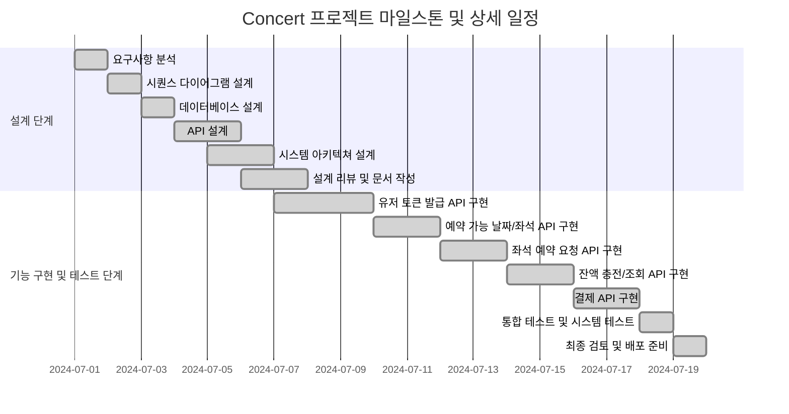
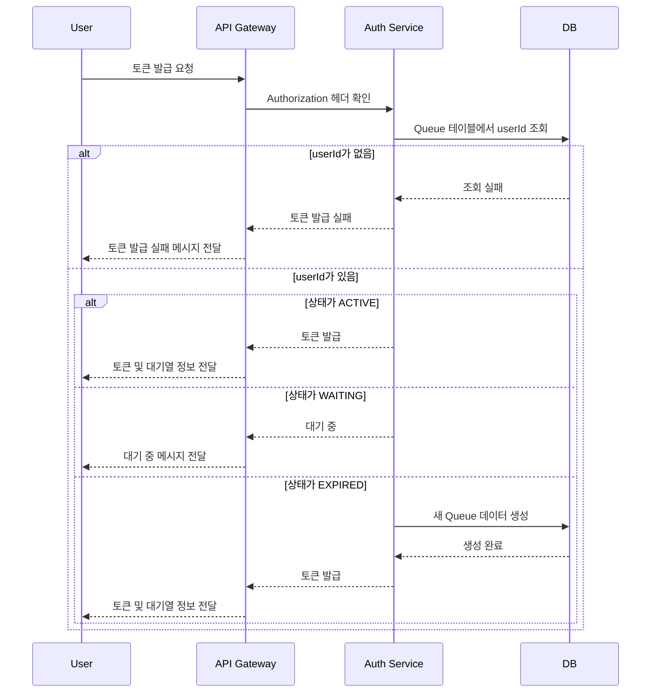
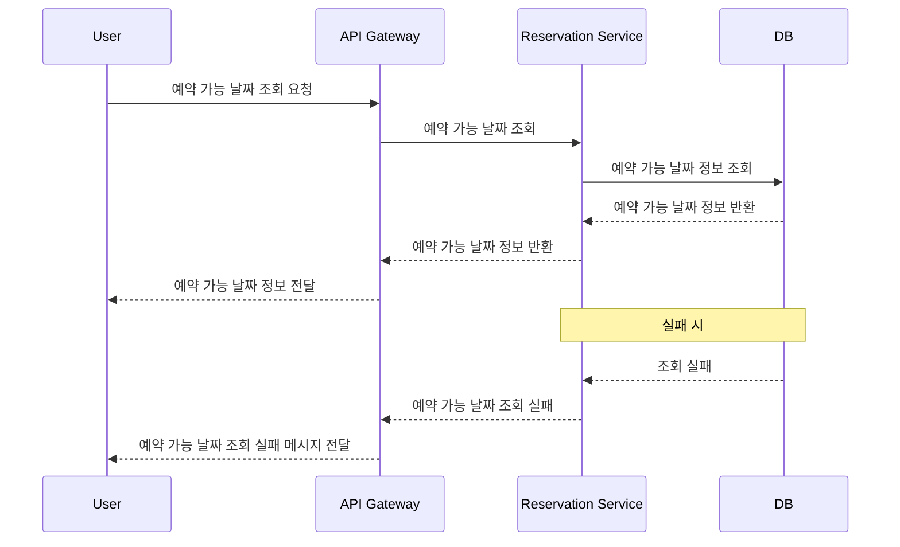
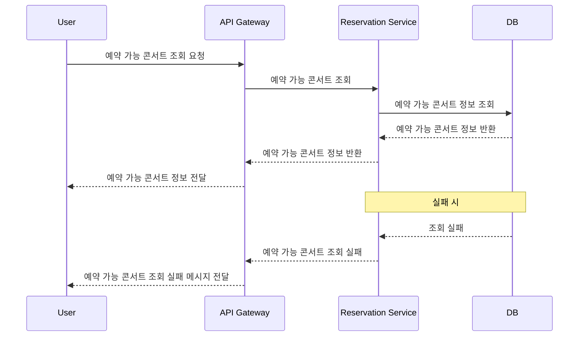
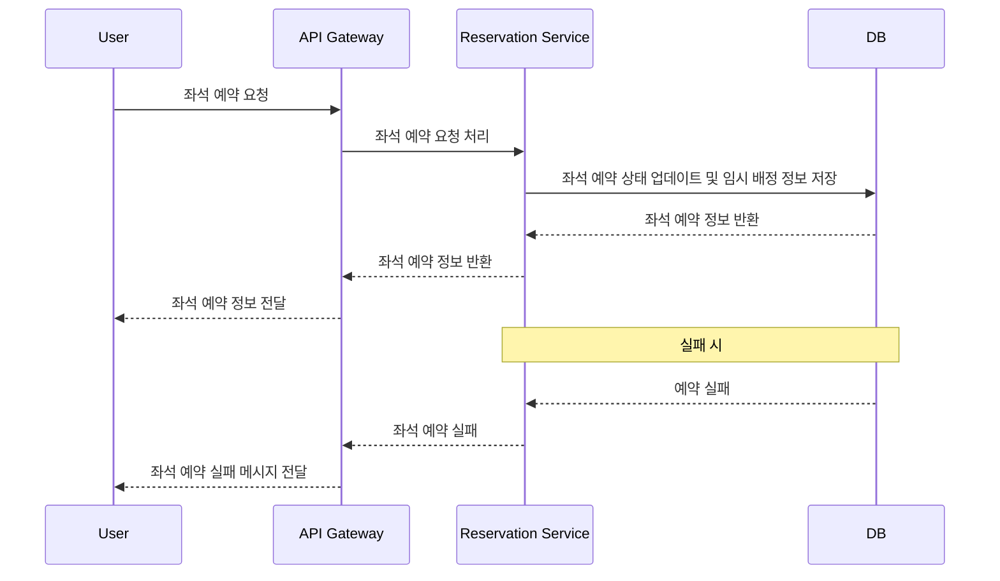
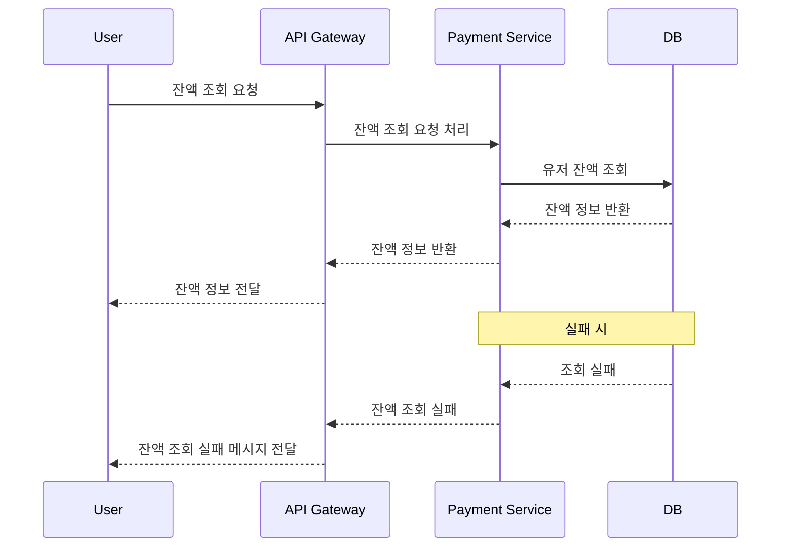
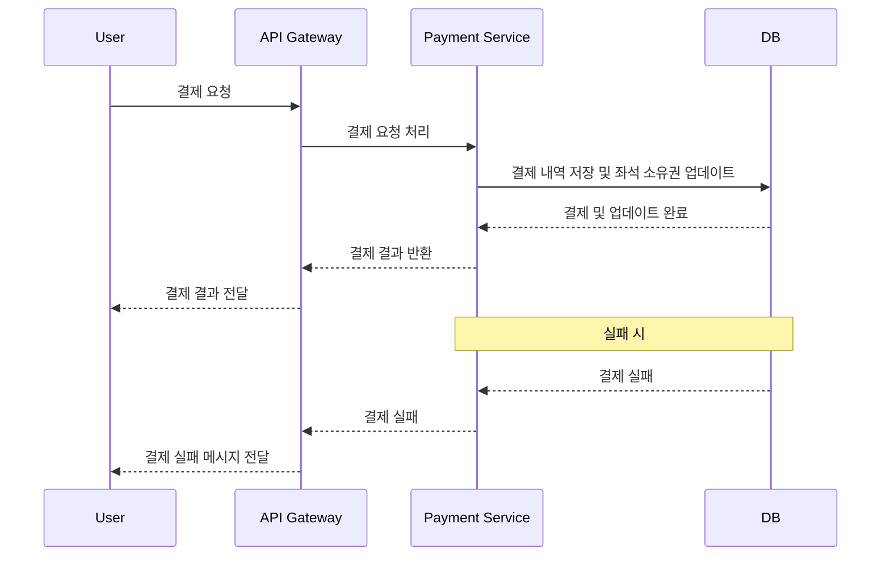
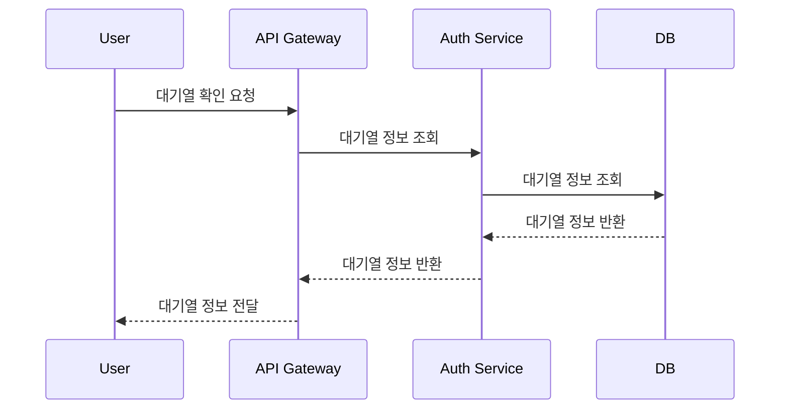
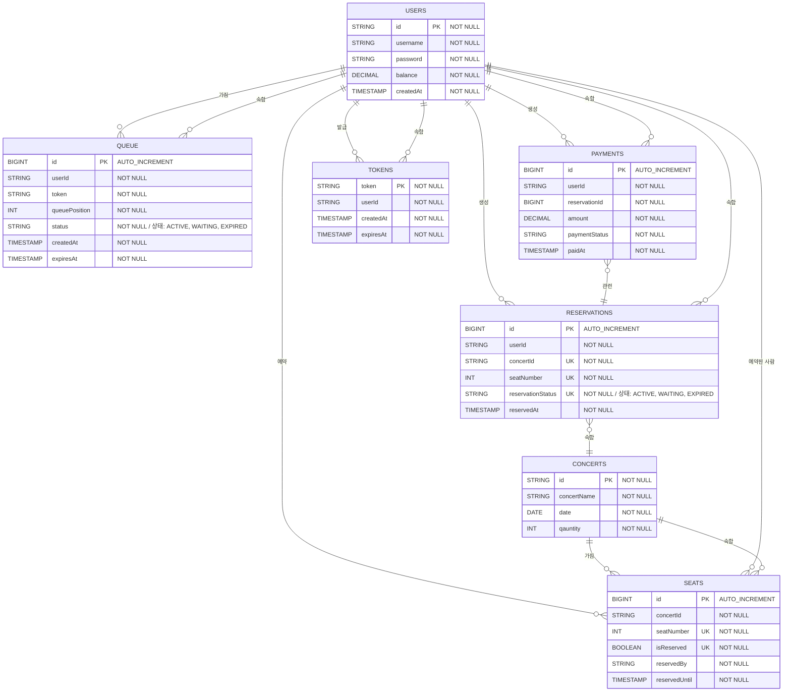

### 프로젝트 개요

콘서트 예약 서비스는 사용자들이 콘서트 좌석을 예약하고, 예약을 위한 잔액을 충전하며, 결제를 완료할 수 있는 시스템입니다. 
이 서비스는 다수의 사용자가 동시에 접근할 수 있는 대기열 시스템을 포함하며, 동시성 이슈를 고려하여 설계하였습니다.

### 주요 기능 및 제약사항

1. 유저 토큰 발급 API: 사용자가 대기열에 들어가서 서비스를 이용할 수 있도록 JWT 토큰을 발급합니다.
2. 예약 가능 날짜 / 좌석 API: 예약 가능한 날짜와 해당 날짜의 좌석 정보를 조회합니다.
3. 좌석 예약 요청 API: 사용자가 좌석을 임시로 예약하고 결제가 이루어지지 않으면 임시 배정을 해제합니다.
4. 잔액 충전 / 조회 API: 사용자가 예약에 사용할 금액을 충전하고, 현재 잔액을 조회합니다.
5. 결제 API: 사용자가 좌석 예약 후 결제를 완료하면 좌석을 최종 배정합니다.
6. 대기열 확인 API: 사용자가 현재 대기열에서 자신의 위치를 확인할 수 있습니다.

### 프로젝트 계획

### 1. 목표 설정

- 유저가 대기열을 통해 콘서트 좌석을 예약하고 결제까지 완료할 수 있는 시스템 구축.
- 동시성 이슈를 고려하여 다수의 사용자가 동시에 접근할 때도 안정적으로 서비스 제공.

### 2. 기술 스택

- **언어**: Java
- **프레임워크**: Spring Boot
- **데이터베이스**: MySQL (대기열 관리 및 데이터 저장)
- **테스트 프레임워크**: JUnit, Mockito
- **인증**: JWT

### 3. 아키텍처 설계

- **모듈 구성**:
    - **User Module**: 사용자 관리 및 인증
    - **Queue Module**: 대기열 관리
    - **Reservation Module**: 예약 처리
    - **Payment Module**: 결제 처리
- **데이터베이스 설계**:
    - **Users**: 유저 정보
    - **Seats**: 좌석 정보
    - **Reservations**: 예약 정보
    - **Payments**: 결제 내역
    - **Queue**: 대기열 정보

### 4. API 설계

### 4.1 유저 토큰 발급 API

- **Endpoint**: `/api/v1/tokens`
- **Method**: POST
- **Request**:
    
    ```json
    {
      "userId": "UUID"
    }
    ```
    
- **Response**:
    
    ```json
    {
      "token": "string",
      "queuePosition": "int",
      "remainingTime": "int"
    }
    ```
    

### 4.2 예약 가능 날짜 / 좌석 API

- **Endpoint**: `/api/v1/concerts`
- **Method**: GET
- **Response**:
    
    ```json
    [
      {
        "concertId": "UUID",
        "concertName": "Concert Name",
        "date": "2024-07-03"
      },
      {
        "concertId": "UUID",
        "concertName": "Concert Name",
        "date": "2024-07-04"
      },
      ...
    ]
    ```
    
- **Endpoint**: `/api/v1/concerts/{concertId}/seats`
- **Method**: GET
- **Response**:
    
    ```json
    [
      {
        "seatNumber": 1,
        "available": true
      },
      {
        "seatNumber": 2,
        "available": false
      },
      ...
    ]
    ```
    

### 4.3 좌석 예약 요청 API

- **Endpoint**: `/api/v1/reservations`
- **Method**: POST
- **Request**:
    
    ```json
    {
      "concertId": "UUID",
      "seatNumber": 1,
      "token": "string"
    }
    ```
    
- **Response**:
    
    ```json
    {
      "reservationId": "UUID",
      "expiresAt": "timestamp"
    }
    ```
    

### 4.4 잔액 충전 / 조회 API

- **Endpoint**: `/api/v1/users/{userId}/balance`
- **Method**: POST
- **Request**:
    
    ```json
    {
      "userId": "UUID",
      "amount": 100
    }
    ```
    
- **Response**:
    
    ```json
    {
      "newBalance": 200
    }
    ```
    
- **Endpoint**: `/api/v1/balances`
- **Method**: GET
- **Request**:
    
    ```json
    {
      "userId": "UUID"
    }
    ```
    
- **Response**:
    
    ```json
    {
      "currentBalance": 200
    }
    ```
    

### 4.5 결제 API

- **Endpoint**: `/api/v1/payments`
- **Method**: POST
- **Request**:
    
    ```json
    {
      "reservationId": "UUID",
      "amount": 100,
      "token": "string"
    }
    ```
    
- **Response**:
    
    ```json
    {
      "paymentId": "UUID",
      "status": "success"
    }
    ```
    

### 4.6 대기열 확인 API

- **Endpoint**: `/api/v1/queue/status`
- **Method**: GET
- **Request**:
    
    ```json
    {
      "token": "string"
    }
    ```
    
- **Response**:
    
    ```json
    {
      "queuePosition": "int",
      "remainingTime": "int"
    }
    ```

## Milestone


## Sequence Diagram
### 유저 토큰 발급 Use Case



### 예약 가능 날짜 조회 Use Case



### 예약 가능 콘서트 조회 Use Case



### 좌석 예약 요청 Use Case



### 좌석 예약 요청 Use Case


### 잔액 충전 요청 Use Case


### 잔액 조회 요청 Use Case



### 결제 요청 Use Case



### 대기열 확인 요청 Use Case



## er Diagram
